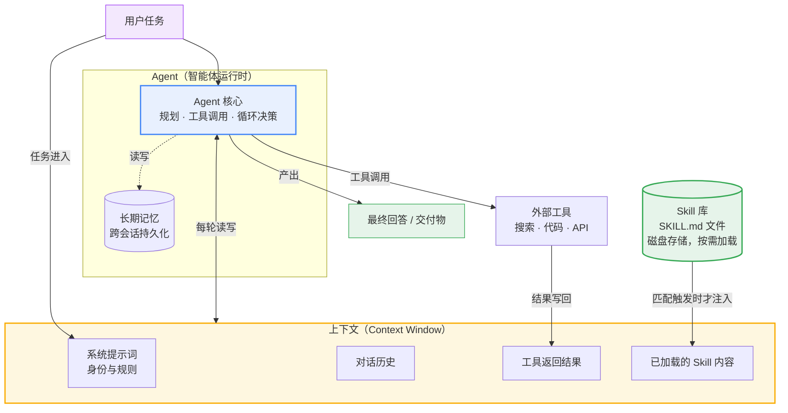

# Agent、上下文（Context）与 Skill 三者关系解析

> 本文是对 `learning-materials/` 目录下三份学习资料（Agent、大模型的上下文、Skill）的综合梳理，说明三个概念如何协同构成现代 AI 应用的核心架构。

## 一、一句话总览

**Agent 是"人"，上下文是"工作记忆"，Skill 是"操作手册"** —— Agent 在有限的上下文空间中思考与决策，Skill 以按需加载的方式为 Agent 注入领域知识和操作流程，从而突破上下文的容量限制。

## 二、关系流程图

## 三、三者关系详解

### 1. Agent 与上下文：演员与舞台

Agent 的每一轮"思考"都发生在上下文窗口之内——它看到的系统提示词、历史对话、工具返回结果，共同构成这一轮决策的全部依据。这带来一个根本约束：

- **上下文是 Agent 唯一的"当下视野"**：窗口之外的信息（哪怕 Agent 上一轮知道）对它而言等于不存在；
- **上下文容量固定**：无论模型多强，窗口大小（如 128K、1M token）是出厂设定的，塞满了就要截断或丢失；
- **Agent 的自主性通过循环体现**：每一轮 = 读上下文 → 决策 → 调工具 → 结果写回上下文 → 再决策，直到任务完成。

### 2. 上下文与 Skill：瓶颈与解药

Skill 的设计动机，正是为了解决上下文的两难困境：

| 困境 | Skill 的解法 |
|------|--------------|
| 全部领域知识塞进上下文 → 窗口装不下，且干扰主线任务 | Skill 平时只占一行元数据（名称+描述），**触发时才加载全文** |
| 长期依赖提示词模板 → 无法沉淀、难以复用 | Skill 以 `SKILL.md` 文件形式**独立存放、版本管理、跨项目共享** |
| Agent 遇到陌生领域 → 缺乏专业流程指导 | Skill 提供该领域的**步骤、命令、规范、避坑经验**，按需注入 |

**关键机制**：Skill 元数据常驻上下文（占用极小），正文按需加载（用完可释放）。这本质上是把"操作系统按需调页"的思想应用到了提示词管理上。

### 3. Agent 与 Skill：执行者与专家知识

Skill 不会自己运行——它是**声明性知识**，必须由 Agent 读取并执行：

- Agent 的通用能力（推理、工具调用）+ Skill 的领域专长（具体流程与命令）= 专家级表现；
- 同一个 Agent 配不同 Skill，即可胜任不同领域任务（这正是"通用智能体 + 可扩展技能"的架构思路）；
- Skill 中可以指定使用某些工具，但 Skill ≠ Tool：**Tool 是手，Skill 是用手的章法**。

### 4. 三者协同的完整闭环

以"用户要求生成学习资料"为例：

1. 用户提出任务 → Agent 接收，任务信息进入上下文；
2. Agent 发现任务匹配 `concept-learning-skill` 的描述 → **加载该 Skill 正文**到上下文；
3. Agent 按 Skill 规定的流程执行（拆解概念 → 强制检索 → 五段式生成 → 自检）；
4. 每次搜索结果作为工具输出**写回上下文**，供下一轮综合使用；
5. 窗口不足时，早期细节可能被压缩或截断——这就是长任务需要分步、必要时借助外部记忆的原因；
6. Agent 产出最终交付物，任务闭环。

## 四、边界提醒（避免混淆）

- **上下文 ≠ 记忆**：上下文是单次会话内的工作记忆，会话结束即清空；长期记忆需要外部存储（文件、数据库）实现。
- **Skill ≠ 微调**：Skill 改变的是"给模型看什么"，不改变模型权重；零训练成本，即装即用。
- **Skill ≠ Tool/MCP**：Tool 是可调用的功能接口，Skill 是教 Agent 何时、如何组合使用工具的知识包。
- **Agent ≠ Skill 的容器那么简单**：Agent 的核心是自主循环决策，Skill 只是增强其能力的手段之一。

---

*本文所有概念性内容均可追溯至 `learning-materials/` 目录下三份学习资料的"来源链接"部分。*
