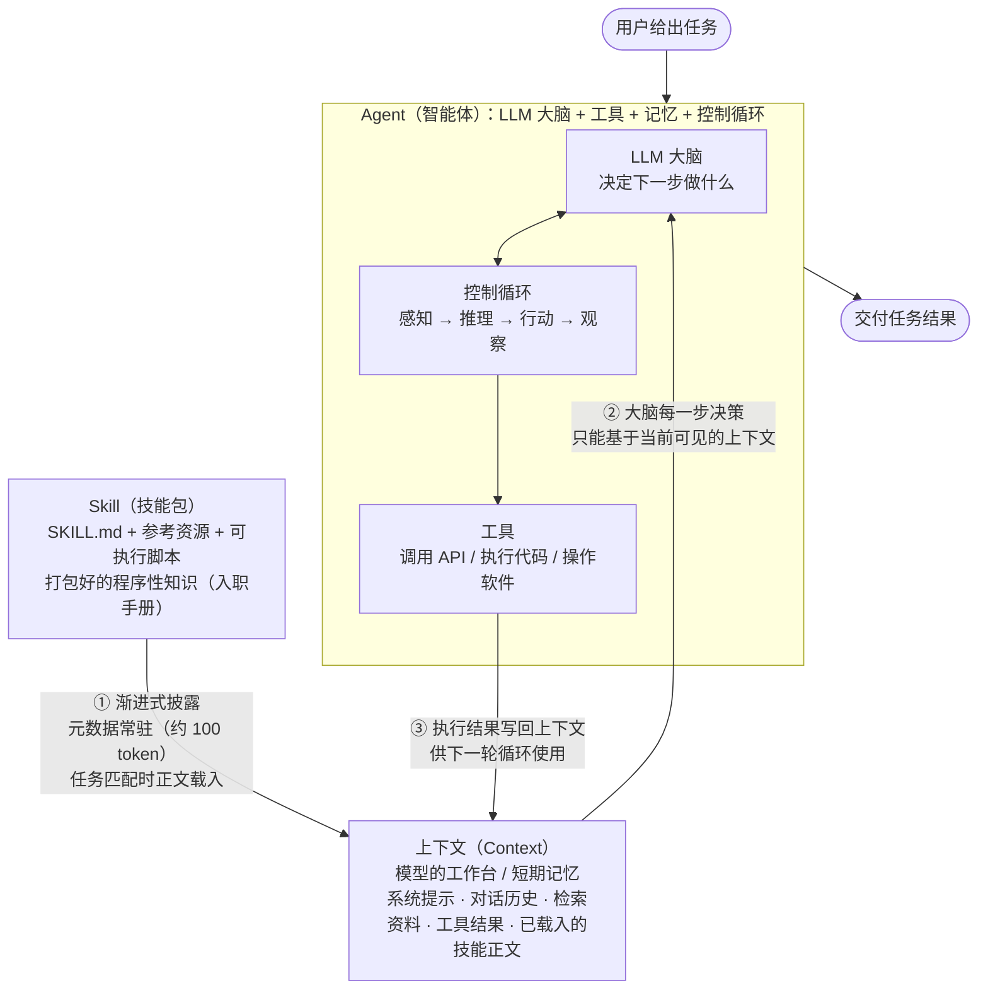

# Agent × 上下文 × Skill：三者关系解析

> 配合三份概念学习资料阅读：[Agent](agent.html) ｜ [大模型的上下文](llm-context.html) ｜ [Skill](skill.html)

## 一句话总览

**Agent 是干活的系统，上下文（Context）是它的工作台兼短期记忆，Skill 是摆上工作台的操作手册。**

三者不是并列的三个"东西"，而是一个协作闭环：**Skill 通过渐进式披露被载入上下文 → 上下文为 Agent 的每一步决策提供信息环境 → Agent 行动后把结果写回上下文**，循环往复直到任务完成。

## 关系总图

## 三对关系拆解

### ① Skill → 上下文：按需加载的"手册上架"

- Skill 平时只以 **元数据**（name + description，约 100 token）驻留在系统提示里，告诉 Agent"有这本手册、什么时候该用"。
- 当任务与 description 匹配时，Agent 才读取 SKILL.md 正文进入上下文；更深层的参考文档和脚本按需再取。
- **没有上下文这个"工作台"，Skill 的知识无处安放**——Skill 生效的方式就是"成为上下文的一部分"。

### ② 上下文 → Agent：决策的唯一依据

- Agent 的 LLM 大脑没有长期记忆，**每一步"下一步做什么"的判断，完全基于当前上下文窗口里可见的信息**。
- 上下文质量直接决定 Agent 表现：技能正文、检索资料、工具返回结果是否在窗口里、是否组织得当，比模型本身大小更影响输出。
- 上下文窗口容量有限，所以 Skill 的渐进式披露才如此重要——手册不摊开时不占桌面。

### ③ Agent → 上下文：行动改变工作台

- Agent 每调用一次工具，返回结果都会写回上下文，成为下一轮"感知—推理—行动—观察"循环的新输入。
- 上下文因此是**动态演化**的：随着 Agent 工作，工作台不断被更新，Agent 的后续决策也随之调整。
- 这也是 Agent 区别于一次性问答的根本：循环让上下文持续积累任务进展。

## 一个完整例子：用 PDF Skill 填表单

1. 用户说："帮我填这份 PDF 表单。"（任务进入上下文）
2. Agent 在系统提示的 Skill 元数据中发现 `pdf-processing` 技能匹配 → 读取其 SKILL.md 正文载入上下文（**Skill → 上下文**）。
3. LLM 大脑基于"表单填写指南 + 用户的 PDF 文件"规划步骤，决定调用技能捆绑的 `fill_form.py` 脚本（**上下文 → Agent**）。
4. 脚本执行，输出"已填入 12 个字段"的结果，该结果写回上下文（**Agent → 上下文**）。
5. 大脑看到结果，确认任务完成，向用户交付填好的 PDF。

## 协同关系速查表

| 角色 | 类比 | 核心职责 | 没有它会怎样 |
|------|------|----------|--------------|
| **Agent** | 干活的员工 | 自主规划、调用工具、完成任务 | 没有执行者，知识与信息只是静态数据 |
| **上下文** | 员工的工作台 | 承载 Agent 决策所需的全部信息 | 大脑"失明"，只能靠训练印象瞎猜 |
| **Skill** | 台上的操作手册 | 把领域程序性知识按需注入上下文 | 通用 Agent 不懂行，每件事都要重新教 |

**三者合起来的故事**：给聪明的员工（Agent）一张容量有限的工作台（上下文），再配一套按需翻阅的操作手册（Skill）——手册上架不占桌面，摊开时员工照章办事，办事记录又写回桌面，推动下一步工作。
